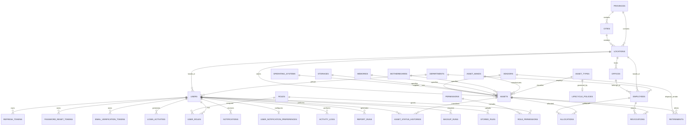

# Database ERD

```mermaid
erDiagram
    USERS ||--o{ USER_ROLES : has
    ROLES ||--o{ USER_ROLES : assigned
    ROLES ||--o{ ROLE_PERMISSIONS : grants
    PERMISSIONS ||--o{ ROLE_PERMISSIONS : includes
    DEPARTMENTS ||--o{ USERS : groups
    LOCATIONS ||--o{ USERS : based_at

    PROVINCES ||--o{ CITIES : contains
    PROVINCES ||--o{ LOCATIONS : contains
    CITIES ||--o{ LOCATIONS : contains
    LOCATIONS ||--o{ OFFICES : hosts
    DEPARTMENTS ||--o{ EMPLOYEES : employs
    LOCATIONS ||--o{ EMPLOYEES : based_at
    OFFICES ||--o{ EMPLOYEES : belongs_to

    ASSET_TYPES ||--o| LIFECYCLE_POLICIES : governed_by
    ASSET_TYPES ||--o{ ASSETS : classifies
    ASSET_MAKES ||--o{ ASSETS : manufactures
    MOTHERBOARDS ||--o{ ASSETS : specifies
    MEMORIES ||--o{ ASSETS : specifies
    STORAGES ||--o{ ASSETS : specifies
    OPERATING_SYSTEMS ||--o{ ASSETS : runs
    VENDORS ||--o{ ASSETS : supplies
    LOCATIONS ||--o{ ASSETS : stores

    ASSETS ||--o{ ALLOCATIONS : allocated
    EMPLOYEES ||--o{ ALLOCATIONS : receives
    ASSETS ||--o{ REVOCATIONS : returned
    EMPLOYEES ||--o{ REVOCATIONS : returns
    ASSETS ||--o{ RETIREMENTS : retires
    VENDORS ||--o{ RETIREMENTS : disposal_vendor
    ASSETS ||--o{ ASSET_STATUS_HISTORIES : transitions
    USERS ||--o{ ASSET_STATUS_HISTORIES : performs

    USERS ||--o{ REFRESH_TOKENS : owns
    USERS ||--o{ PASSWORD_RESET_TOKENS : owns
    USERS ||--o{ EMAIL_VERIFICATION_TOKENS : owns
    USERS ||--o{ LOGIN_ACTIVITIES : generates
    USERS ||--o{ NOTIFICATIONS : receives
    USERS ||--o| USER_NOTIFICATION_PREFERENCES : configures
    USERS ||--o{ ACTIVITY_LOGS : performs
    USERS ||--o{ REPORT_RUNS : generates
    USERS ||--o{ BACKUP_RUNS : requests
    USERS ||--o{ STORED_FILES : uploads
```
