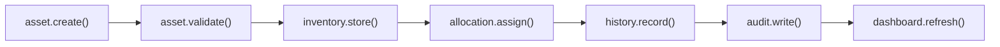
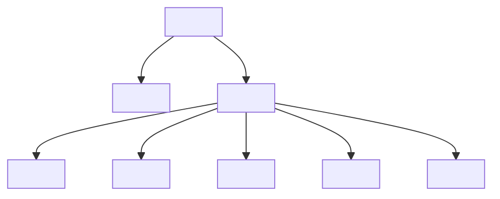
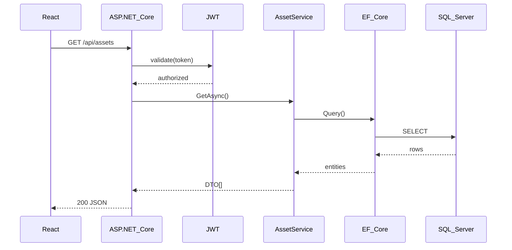
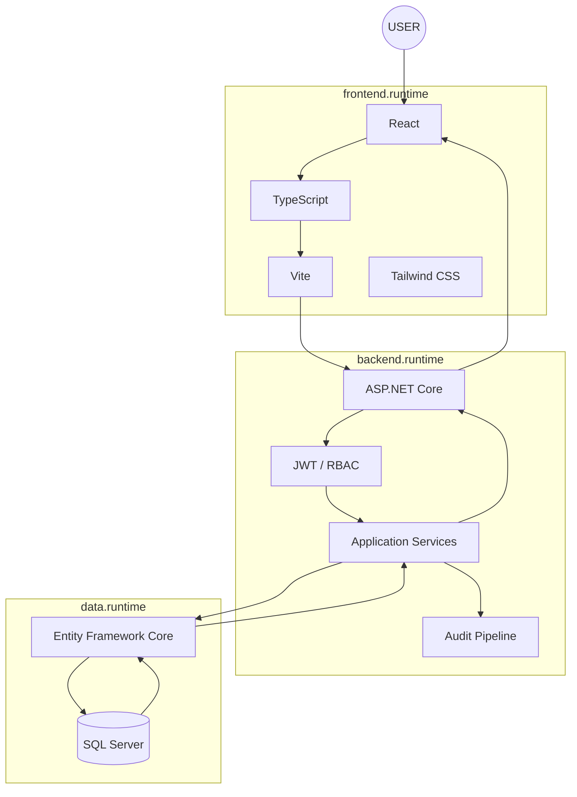
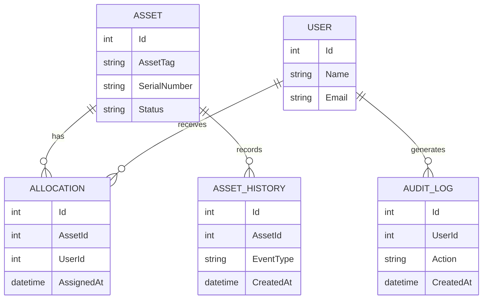
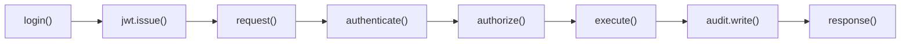
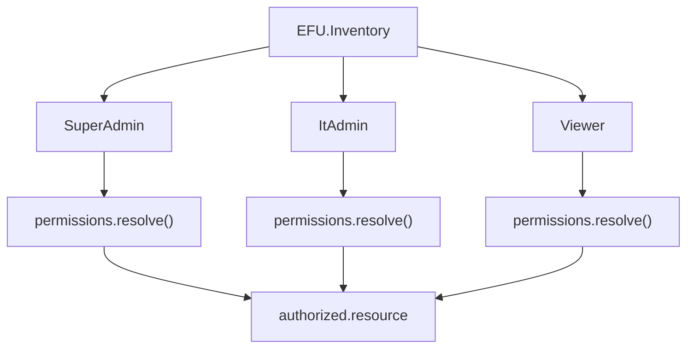
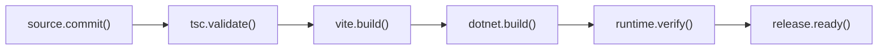
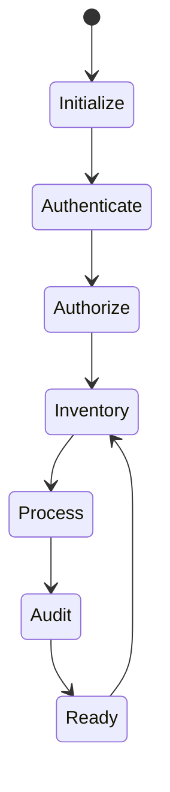

# EFU IT Hardware Inventory System

Enterprise hardware inventory application with a React, TypeScript, Vite and Tailwind frontend and an ASP.NET Core, Entity Framework Core and SQL Server backend.

## Requirements

- Node.js 20 or newer
- .NET SDK 10
- SQL Server or SQL Server LocalDB

## Backend

Copy `backend/.env.example` values into environment variables or a secure development-secret store. A new database requires `BootstrapAdmin__Email`, `BootstrapAdmin__Password`, `Jwt__Secret`, and `ConnectionStrings__DefaultConnection`.

```powershell
cd backend
dotnet restore EFU.Inventory.csproj
dotnet run --project EFU.Inventory.csproj
```

Development URL: `http://localhost:5002`

## Frontend

Copy `frontend/.env.development.example` to `frontend/.env.development` and adjust the API URL if necessary.

```powershell
cd frontend
npm install
npm run dev
```

Development URL: `http://localhost:5173`

Production validation:

```powershell
npx tsc --noEmit
npm run build
```

## Configuration

Frontend:

- `VITE_API_URL` — complete API base URL including `/api`
- `VITE_PORT` — Vite development or preview port

Backend:

- `ConnectionStrings__DefaultConnection`
- `Jwt__Secret`, `Jwt__Issuer`, `Jwt__Audience`
- `Jwt__AccessTokenMinutes`, `Jwt__RefreshTokenDays`
- `FrontendUrl`
- `BootstrapAdmin__Email`, `BootstrapAdmin__Password` for a new database
- `SMTP__Host`, `SMTP__Port`, `SMTP__Username`, `SMTP__Password`, `SMTP__From`

Never commit production passwords, JWT secrets, SMTP credentials, or production connection strings.

---
<!-- ======================================================================= -->

<!--                                                                         -->

<!--                    EFU IT HARDWARE INVENTORY SYSTEM                     -->

<!--                                                                         -->

<!-- ======================================================================= -->

<div align="center">


<br/>


<br/><br/>

<a href="#runtime">

</a>

<a href="#modules">

</a>

<a href="#architecture">

</a>

<a href="#security">

</a>

<a href="#setup">

</a>

</div>

---

```csharp
namespace EFU.Inventory
{
    public sealed class EnterprisePlatform
    {
        public string Name =>
            "EFU IT Hardware Inventory System";

        public string[] Frontend =>
        [
            "React",
            "TypeScript",
            "Vite",
            "Tailwind CSS"
        ];

        public string[] Backend =>
        [
            "ASP.NET Core",
            ".NET 10",
            "Entity Framework Core",
            "REST API"
        ];

        public string Database =>
            "SQL Server";

        public string[] Security =>
        [
            "JWT Authentication",
            "Role Based Authorization",
            "Protected API Routes",
            "Audit Logging",
            "Environment Secret Management"
        ];

        public async Task<SystemStatus> BootAsync()
        {
            await Frontend.InitializeAsync();
            await Api.InitializeAsync();
            await SecurityLayer.InitializeAsync();
            await InventoryService.InitializeAsync();
            await Database.ConnectAsync();

            return SystemStatus.Ready;
        }
    }
}
```

<div align="center">


</div>

---

<a id="runtime"></a>

# `01 // RUNTIME.BOOT()`

```powershell
PS EFU:\Inventory> ./boot.ps1

> Import-Module EFU.Inventory
> Initialize-EnterpriseKernel
> Initialize-FrontendRuntime
> Initialize-ApiGateway
> Initialize-SecurityLayer
> Initialize-InventoryModule
> Initialize-AuditPipeline
> Connect-Database
> Start-System

[██████████████████████████████████████████████████] 100%

EFU.Inventory::Runtime
{
    Frontend       = "READY"
    Backend        = "READY"
    Api            = "READY"
    Authentication = "ENABLED"
    Authorization  = "ENABLED"
    Database       = "CONFIGURED"
    Audit          = "ENABLED"
}
```

```typescript
type SystemRuntime = {
    frontend: "React";
    language: "TypeScript";
    api: "ASP.NET Core";
    orm: "Entity Framework Core";
    database: "SQL Server";

    authentication: {
        strategy: "JWT";
        state: "enabled";
    };

    authorization: {
        strategy: "RBAC";
        state: "enabled";
    };
};

const runtime: SystemRuntime = {
    frontend: "React",
    language: "TypeScript",
    api: "ASP.NET Core",
    orm: "Entity Framework Core",
    database: "SQL Server",

    authentication: {
        strategy: "JWT",
        state: "enabled"
    },

    authorization: {
        strategy: "RBAC",
        state: "enabled"
    }
};
```

<div align="center">


</div>

---

<a id="modules"></a>

# `02 // MODULES.LOAD()`

```javascript
const inventory = await system.load({
    modules: {
        assets: {
            create: true,
            update: true,
            inspect: true,
            history: true
        },

        allocations: {
            assign: true,
            transfer: true,
            returnAsset: true,
            history: true
        },

        dashboard: {
            inventory: true,
            allocations: true,
            status: true,
            reporting: true
        },

        security: {
            authentication: true,
            authorization: true,
            auditing: true
        }
    }
});
```

```typescript
interface AssetRuntime {
    assetTag: string;
    serialNumber: string;
    status: string;
    assignedTo?: string;
    department?: string;
    office?: string;
}

async function executeAssetLifecycle(asset: AssetRuntime) {

    await inventory.assets.register(asset);

    await inventory.assets.validate(asset);

    await inventory.allocations.assign(asset);

    await inventory.history.record(asset);

    await audit.write({
        action: "ASSET_LIFECYCLE_EXECUTED",
        assetTag: asset.assetTag
    });

    return asset;
}
```

```csharp
public sealed class InventoryService
{
    private readonly AppDbContext _db;
    private readonly AuditService _audit;

    public InventoryService(
        AppDbContext db,
        AuditService audit)
    {
        _db = db;
        _audit = audit;
    }

    public async Task ExecuteAsync()
    {
        await LoadAssetsAsync();
        await LoadAllocationsAsync();
        await LoadHistoryAsync();
        await _audit.WriteAsync();
    }
}
```

---

# `03 // PIPELINE.EXECUTE()`



```javascript
await asset.create();

await asset.validate();

await inventory.store(asset);

await allocation.assign(asset);

await history.record(asset);

await audit.write(asset);

await dashboard.refresh();
```

<div align="center">


</div>

---

# `04 // FRONTEND.RENDER()`

```tsx
export default function InventoryApplication() {
    return (
        <ApplicationShell>

            <Sidebar />

            <MainRuntime>

                <Dashboard />

                <AssetInventory />

                <AssetAllocation />

                <Reports />

                <Administration />

            </MainRuntime>

        </ApplicationShell>
    );
}
```

```typescript
const frontend = defineApplication({

    engine: "React",

    language: "TypeScript",

    compiler: "Vite",

    styling: "Tailwind CSS",

    api: {
        baseUrl: import.meta.env.VITE_API_URL
    },

    runtime: {
        dashboard: true,
        assets: true,
        allocations: true,
        reports: true
    }

});
```



---

# `05 // API.REQUEST()`

```http
GET /api/assets HTTP/1.1
Host: localhost:5002
Authorization: Bearer <access-token>
Accept: application/json
```

```javascript
const response = await fetch(
    `${API_URL}/assets`,
    {
        method: "GET",

        headers: {
            Authorization: `Bearer ${token}`,
            Accept: "application/json"
        }
    }
);

const assets = await response.json();
```

```csharp
[ApiController]
[Route("api/[controller]")]
[Authorize]
public sealed class AssetsController : ControllerBase
{
    private readonly AssetService _assets;

    public AssetsController(AssetService assets)
    {
        _assets = assets;
    }

    [HttpGet]
    public async Task<IActionResult> GetAsync()
    {
        var result =
            await _assets.GetAsync();

        return Ok(result);
    }
}
```



---

<a id="architecture"></a>

# `06 // ARCHITECTURE.COMPILE()`



```csharp
namespace EFU.Inventory.Architecture
{
    public static class DependencyGraph
    {
        public static readonly string[] Runtime =
        [
            "User",
            "React",
            "TypeScript",
            "REST API",
            "ASP.NET Core",
            "Authentication",
            "Authorization",
            "Application Services",
            "Entity Framework Core",
            "SQL Server"
        ];
    }
}
```

<div align="center">


</div>

---

# `07 // DATABASE.QUERY()`

```sql
SELECT
    AssetTag,
    SerialNumber,
    Status
FROM Assets;
```

```sql
SELECT
    a.AssetTag,
    a.SerialNumber,
    a.Status
FROM Assets AS a
WHERE a.IsActive = 1
ORDER BY a.AssetTag;
```

```csharp
var assets =
    await _db.Assets
        .AsNoTracking()
        .Where(asset => asset.IsActive)
        .OrderBy(asset => asset.AssetTag)
        .ToListAsync();
```



---

<a id="security"></a>

# `08 // SECURITY.ENFORCE()`

```csharp
services
    .AddAuthentication()
    .AddJwtBearer();

services.AddAuthorization();
```

```csharp
[Authorize]
public async Task<IActionResult> SecureOperation()
{
    var identity =
        User.Identity;

    if (identity?.IsAuthenticated != true)
        return Unauthorized();

    await _audit.WriteAsync();

    return Ok();
}
```

```typescript
async function secureRequest<T>(
    endpoint: string
): Promise<T> {

    const token =
        sessionStorage.getItem("accessToken");

    const response =
        await fetch(endpoint, {
            headers: {
                Authorization: `Bearer ${token}`
            }
        });

    if (!response.ok)
        throw new Error(
            `HTTP_${response.status}`
        );

    return response.json();
}
```



```diff
- Production passwords
- JWT secrets
- SMTP credentials
- Production connection strings
- Bootstrap administrator passwords
- Private environment files

+ Environment variables
+ .NET User Secrets
+ Protected CI/CD secrets
+ Secret managers
+ .gitignore
```

---

# `09 // RBAC.RESOLVE()`

```typescript
type Role =
    | "SuperAdmin"
    | "ItAdmin"
    | "Viewer";

type Permission =
    | "asset.read"
    | "asset.write"
    | "allocation.read"
    | "allocation.write"
    | "report.read"
    | "audit.read";
```



---

# `10 // AUDIT.WRITE()`

```csharp
public async Task WriteAuditAsync(
    string action,
    string entity,
    string entityId)
{
    var entry = new AuditLog
    {
        Action = action,
        Entity = entity,
        EntityId = entityId,
        CreatedAt = DateTime.UtcNow
    };

    _db.AuditLogs.Add(entry);

    await _db.SaveChangesAsync();
}
```

```json
{
  "event": "ASSET_UPDATED",
  "entity": "Asset",
  "entityId": "<asset-id>",
  "timestamp": "<utc-time>"
}
```

---

# `11 // REPORT.EXPORT()`

```typescript
async function exportAssetReport(
    assetId: string
) {
    const asset =
        await api.assets.get(assetId);

    const history =
        await api.assets.history(assetId);

    return generateReport({
        asset,
        history
    });
}
```

```javascript
const report = {
    type: "INDIVIDUAL_ASSET_REPORT",

    source: {
        asset,
        allocationHistory,
        auditHistory
    },

    output: "PDF"
};
```

---

# `12 // BUILD.PIPELINE()`



```powershell
PS EFU:\Inventory\frontend> npx tsc --noEmit

PS EFU:\Inventory\frontend> npm run build

PS EFU:\Inventory\backend> dotnet build EFU.Inventory.csproj
```

---

<a id="setup"></a>

# `13 // ENVIRONMENT.INSTALL()`

```powershell
node --version

dotnet --version
```

```text
Node.js >= 20
.NET SDK = 10
SQL Server = supported
SQL Server LocalDB = supported
```

```powershell
cd backend

dotnet restore EFU.Inventory.csproj

dotnet run --project EFU.Inventory.csproj
```

```typescript
const backend = {
    url: "http://localhost:5002"
};
```

```powershell
cd frontend

npm install

npm run dev
```

```typescript
const frontend = {
    url: "http://localhost:5173"
};
```

---

# `14 // ENVIRONMENT.CONFIGURE()`

```env
VITE_API_URL=http://localhost:5002/api
VITE_PORT=5173
```

```env
ConnectionStrings__DefaultConnection=

Jwt__Secret=
Jwt__Issuer=
Jwt__Audience=

Jwt__AccessTokenMinutes=
Jwt__RefreshTokenDays=

FrontendUrl=

BootstrapAdmin__Email=
BootstrapAdmin__Password=

SMTP__Host=
SMTP__Port=
SMTP__Username=
SMTP__Password=
SMTP__From=
```

---

# `15 // DIRECTORY.TRAVERSE()`

```text
EFU-Inventory-System
│
├── frontend
│   ├── src
│   ├── public
│   ├── package.json
│   ├── vite.config.ts
│   └── .env.development
│
├── backend
│   ├── Controllers
│   ├── Data
│   ├── DTOs
│   ├── Models
│   ├── Services
│   ├── Middleware
│   ├── EFU.Inventory.csproj
│   └── appsettings.json
│
├── README.md
│
└── .gitignore
```

---

# `16 // RUNTIME.LOOP()`

```typescript
async function runtime() {

    while (system.running) {

        await authentication.validate();

        await inventory.synchronize();

        await allocation.observe();

        await dashboard.refresh();

        await audit.flush();

        await system.wait();
    }
}

runtime();
```

```csharp
while (!cancellationToken.IsCancellationRequested)
{
    await inventory.ProcessAsync(
        cancellationToken
    );

    await audit.FlushAsync(
        cancellationToken
    );
}
```

```python
while system.running:

    authenticate()

    authorize()

    process_inventory()

    record_audit()

    refresh_runtime()
```

```sql
BEGIN TRANSACTION;

SELECT *
FROM Assets;

COMMIT;
```

<div align="center">


</div>

---

# `17 // SYSTEM.STATUS()`

```json
{
  "application": "EFU IT Hardware Inventory System",

  "runtime": {
    "frontend": "React + TypeScript",
    "backend": "ASP.NET Core",
    "database": "SQL Server"
  },

  "security": {
    "authentication": "JWT",
    "authorization": "RBAC",
    "audit": true
  },

  "development": {
    "frontend": "http://localhost:5173",
    "backend": "http://localhost:5002"
  }
}
```



---

<div align="center">


<br/><br/>

```console
EFU.Inventory@enterprise:~$ system.status()

{
    process     : "RUNNING",
    environment : "ENTERPRISE",
    runtime     : "READY"
}

EFU.Inventory@enterprise:~$ _
```

<br/>


</div>
